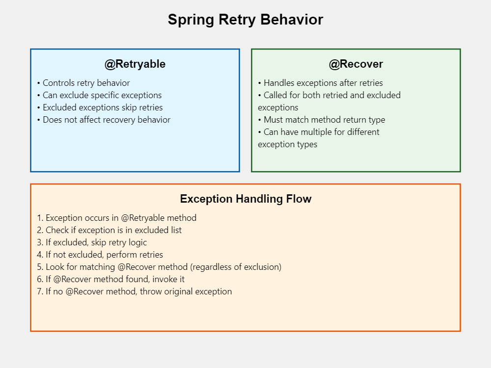

# Spring Retry

## Table of Contents
1. [Introduction](#introduction)
2. [@Retryable Annotation](#retryable-annotation)
3. [@Recover Annotation](#recover-annotation)
4. [Exception Handling Flow](#exception-handling-flow)
5. [Internal Workings](#internal-workings)
6. [Code Examples](#code-examples)
7. [Best Practices](#best-practices)
8. [Common Pitfalls](#common-pitfalls)
9. [Advanced Usage](#advanced-usage)
10. [Conclusion](#conclusion)


### TLDR


## Introduction

Spring Retry is a powerful library that provides declarative retry support for Spring applications. It allows you to automatically retry operations that might fail due to temporary issues, such as network problems or transient service failures.

## @Retryable Annotation

The `@Retryable` annotation is used to mark methods that should be retried in case of failure.

Key features:
- Controls retry behavior
- Can exclude specific exceptions
- Configures max attempts, backoff policy, etc.

Basic usage:

```java
@Service
public class MyService {
    @Retryable(maxAttempts = 3, exclude = {IllegalArgumentException.class})
    public String doSomething() {
        // Method implementation that might fail
        return "Operation successful";
    }
}
```

## @Recover Annotation

The `@Recover` annotation is used to define recovery methods that are called when all retry attempts have been exhausted.

Key points:
- Handles exceptions after retries
- Called for both retried and excluded exceptions
- Must match the return type of the @Retryable method
- Can have multiple recover methods for different exception types

Example:

```java
@Service
public class MyService {
    @Retryable(maxAttempts = 3, exclude = {IllegalArgumentException.class})
    public String doSomething() {
        // Method implementation
    }

    @Recover
    public String recover(RuntimeException e) {
        return "Recovered from: " + e.getMessage();
    }

    @Recover
    public String recoverFromIllegalArgument(IllegalArgumentException e) {
        return "Recovered from IllegalArgumentException: " + e.getMessage();
    }
}
```

## Exception Handling Flow

1. Exception occurs in @Retryable method
2. Check if exception is in the excluded list
3. If excluded, skip retry logic
4. If not excluded, perform retries based on the configured policy
5. Look for matching @Recover method (regardless of exclusion)
6. If @Recover method found, invoke it
7. If no @Recover method, throw the original exception

## Internal Workings

Spring Retry uses Aspect-Oriented Programming (AOP) to implement its functionality:

1. AOP intercepts calls to @Retryable methods
2. The method is wrapped in a RetryOperationsInterceptor
3. RetryTemplate is used to execute the actual retries
4. RetryPolicy determines when to retry (e.g., max attempts, backoff)
5. RecoveryCallback is used to invoke @Recover methods if retries fail

Simplified internal flow:

```java
try {
    // Execute @Retryable method
} catch (Exception e) {
    if (isExcluded(e)) {
        // Skip retry logic
    } else {
        // Perform retries based on RetryPolicy
    }
    
    // Always attempt recovery
    RecoverMethod recoverMethod = findMatchingRecoverMethod(e);
    if (recoverMethod != null) {
        return recoverMethod.invoke(e);
    } else {
        throw e;
    }
}
```

## Code Examples

### Basic Retry with Recovery

```java
@Service
public class RetryService {

    @Retryable(maxAttempts = 3, backoff = @Backoff(delay = 1000))
    public String performOperation() {
        // Simulating an operation that might fail
        if (Math.random() < 0.7) {
            throw new RuntimeException("Operation failed");
        }
        return "Operation successful";
    }

    @Recover
    public String recover(RuntimeException e) {
        return "Recovered from failure: " + e.getMessage();
    }
}
```

### Retry with Multiple Recovery Methods

```java
@Service
public class ComplexRetryService {

    @Retryable(maxAttempts = 3, 
               include = {SQLException.class, IOException.class},
               exclude = {IllegalArgumentException.class})
    public String complexOperation(String input) throws SQLException, IOException {
        // Complex operation that might throw various exceptions
    }

    @Recover
    public String recoverFromSQLException(SQLException e) {
        return "Recovered from SQL error: " + e.getMessage();
    }

    @Recover
    public String recoverFromIOException(IOException e) {
        return "Recovered from IO error: " + e.getMessage();
    }

    @Recover
    public String recoverFromOtherExceptions(Exception e) {
        return "Recovered from unexpected error: " + e.getMessage();
    }
}
```

## Best Practices

1. Use specific exception types: Avoid retrying on broad exception types like `Exception`.
2. Set appropriate max attempts: Consider the nature of the operation and potential recovery time.
3. Use backoff policies: Implement exponential backoff to avoid overwhelming the system.
4. Implement idempotent operations: Ensure that retried operations can be safely repeated.
5. Log retry attempts: Add logging to track retry behavior for monitoring and debugging.
6. Use stateless retry: Avoid storing retry state in memory for long-running processes.

## Common Pitfalls

1. Overusing retries: Not all operations should be retried. Consider the nature of the failure.
2. Ignoring excluded exceptions: Remember that @Recover methods are still called for excluded exceptions.
3. Mismatching return types: Ensure @Recover methods match the return type of the @Retryable method.
4. Neglecting timeout settings: Set appropriate timeouts to prevent indefinite retries.
5. Retrying non-transient failures: Only retry operations that have a chance of succeeding on subsequent attempts.

## Advanced Usage

### Custom Retry Listener

```java
public class CustomRetryListener implements RetryListener {
    @Override
    public <T, E extends Throwable> boolean open(RetryContext context, RetryCallback<T, E> callback) {
        // Called before the first attempt
        return true;
    }

    @Override
    public <T, E extends Throwable> void close(RetryContext context, RetryCallback<T, E> callback, Throwable throwable) {
        // Called after the last attempt
    }

    @Override
    public <T, E extends Throwable> void onError(RetryContext context, RetryCallback<T, E> callback, Throwable throwable) {
        // Called after each failed attempt
    }
}
```

### Programmatic Retry

```java
@Autowired
private RetryTemplate retryTemplate;

public String performWithRetry() {
    return retryTemplate.execute(context -> {
        // Your retryable logic here
        return "Success";
    }, context -> {
        // Recovery logic here
        return "Recovered";
    });
}
```

## Conclusion

Spring Retry provides a powerful and flexible way to implement retry logic in Spring applications. By understanding its core components (@Retryable and @Recover), exception handling flow, and internal workings, developers can effectively use this library to improve the resilience of their applications.

Remember to use retries judiciously, implement appropriate backoff strategies, and always consider the idempotence of your operations when applying retry logic.

For more detailed information, refer to the [official Spring Retry documentation](https://github.com/spring-projects/spring-retry).
